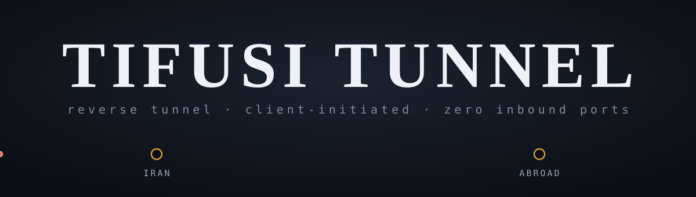

<p align="center">
  
</p>

<p align="center">
  
</p>

<p align="center">
  
  
  
  
  
</p>

<p align="center">
  <a href="#english">🇬🇧 English</a> &nbsp;/&nbsp; <a href="#persian"> فارسی</a> &nbsp;/&nbsp; <a href="#russian">🇷🇺 Русский</a>
</p>

<a name="english"></a>
## English

A reverse tunnel that publishes a foreign VPN server through an Iran server.
The foreign machine dials **out**, so it never needs an open inbound port and its
IP is never contacted directly by users.

```
VPN user ──► Iran VPS  :1194 / :500 / :4500 ...
                 ▲
                 │  one tunnel port (TLS / WSS), dialed out by the foreign VPS
                 │
             Foreign VPS ──► 127.0.0.1:1194  (vpn-ui / Xray / strongSwan / OpenVPN)
```

* Iran server = `mode: server` — owns all public ports and the port map.
* Foreign server = `mode: client` — keeps warm connections open and dials the local services.

## Install (one line, on both servers)

```bash
bash <(curl -fsSL https://raw.githubusercontent.com/javadtifusi-eng/Tifusi-Tunnel/main/install.sh)
```

Then:

1. On the **Iran** server choose `2`, note the token it prints, and add the ports you need.
2. On the **foreign** server choose `3` and paste the Iran IP, port and token.

## Protocol support

| Service | Ports | Works |
|---|---|---|
| OpenVPN | TCP or UDP 1194 | yes |
| L2TP/IPsec | UDP 500, 4500, 1701 | see below — plain forward is unreliable, use the WireGuard bridge |
| IKEv2 | UDP 500, 4500 | see below — plain forward is unreliable, use the WireGuard bridge |
| WireGuard | UDP 51820 | yes |
| VLESS / VMess / Trojan / Xray | TCP 443 etc. | yes |
| vpn-ui panel | TCP 8081 | yes |
| SSH, HTTP, any TCP service | any | yes |

Both TCP and UDP are carried. Bare ESP (IP protocol 50) is *not* forwarded —
that is a property of any userspace relay, not a bug.

### Why L2TP/IPsec and IKEv2 need the WireGuard bridge, not a plain forward

The plain relay opens an independent connection per forwarded port. IPsec
needs the peer's identity (source IP) to stay the same across ports 500 and
4500 to recognize one session — the plain relay can't guarantee that, so
adding `500`/`4500` as ordinary forwards will often fail to connect, or
connect unreliably. The fix is the built-in **WireGuard bridge**
(`bm` → `Manage` → `WireGuard bridge`): a private server-to-server link that
lets the Iran server do real kernel NAT for these two ports — exactly like a
home router forwarding a port — which keeps the peer identity IPsec expects.
Set it up on the foreign side first (to get its public key), then the Iran
side (answer `Y` to routing L2TP/IPsec through the bridge — this also removes
any old 500/4500 forwards automatically), then finish the foreign side with
the Iran server's public key. `bm`'s prompts walk through it in order.

> Important: the port a service really listens on is not always the port shown
> in an exported config. vpn-ui, for example, serves OpenVPN on **1194**
> internally while its `externalProxy` value (8081) is only the public port
> written into `.ovpn` files. Forward the real listen port.

## Transports

| Value | What it looks like on the wire |
|---|---|
| `tcp` | raw stream, fastest, no disguise |
| `tls` | TLS 1.2+ with a self-signed certificate and a fake SNI |
| `ws` | HTTP `Upgrade: websocket` handshake, then real RFC 6455 frames |
| `wss` | the same, inside TLS — best against DPI, and safe to sit behind a WebSocket-aware reverse proxy or CDN |
| `tcpmux` | like `tcp`, but multiplexed — see below |
| `wsmux` | like `ws`, but multiplexed |
| `wssmux` | like `wss`, but multiplexed |
| `udp` | raw UDP via [KCP](https://github.com/xtaci/kcp-go), no disguise — fast retransmit, good on lossy links |

Note on `ws`/`wss`: both the handshake and the traffic after it are real
WebSocket — every tunnel message is sent as one binary frame (masked when
sent by the client, per RFC 6455), fragmented frames from an intermediary
are reassembled transparently, and pings are answered automatically. This
is what makes it possible to place the Iran-side server behind an nginx
WebSocket proxy or a CDN instead of only a plain TCP passthrough.

### Real certificates for `tls`/`wss`/`wssmux`

By default these generate a fresh self-signed certificate on every start
— fine against DPI that only reads the ClientHello's SNI, but a
self-signed cert stands out to anyone who actively probes the port. If a
domain's DNS points at the Iran server, `bm` can request a real, free
certificate from Let's Encrypt for it automatically (setup asks "Do you
have a domain pointing at this server?", or add one later from `Edit
settings`) — set `"domain"` in `config.json` to do it by hand. Needs port
80 reachable for the ACME HTTP-01 challenge; the foreign/client side
needs no changes, since it already ignores certificate validity (it's
authenticated by the shared token, not the certificate).

### Plain vs. mux transports

`tcp`/`tls`/`ws`/`wss` open one physical connection per forwarded TCP
session or UDP flow, drawn from a pool of `pool` connections the foreign
server keeps warm. Simple, and works well.

`tcpmux`/`wsmux`/`wssmux` instead keep a small, fixed number of physical
connections open (`mux_con`, default 8 — Backhaul users will recognize the
model) and multiplex every session as a logical stream over whichever one
is picked, the way [Backhaul](https://github.com/Musixal/Backhaul) does.
This means far fewer open sockets and handshakes on the foreign server
under many simultaneous sessions, at the cost of some head-of-line
blocking on each physical connection when it is very busy — raise
`mux_con` to spread load across more of them.

## Configuration

`/etc/tifusi/config.json` on the Iran server:

```json
{
  "mode": "server",
  "listen": "0.0.0.0:8443",
  "transport": "wss",
  "token": "8f3c...",
  "sni": "www.bing.com",
  "path": "/tunnel",
  "forwards": [
    { "name": "OpenVPN", "listen": "0.0.0.0:1194", "net": "udp", "target": "127.0.0.1:1194" },
    { "name": "L2TP",    "listen": "0.0.0.0:4500", "net": "udp", "target": "127.0.0.1:4500" }
  ]
}
```

`target` is resolved **on the foreign server**, so `127.0.0.1` means "the VPN
service running next to the client".

On the foreign server:

```json
{
  "mode": "client",
  "server": "IRAN_SERVER_IP:8443",
  "transport": "wss",
  "token": "8f3c...",
  "sni": "www.bing.com",
  "path": "/tunnel",
  "pool": 8
}
```

`pool` is how many connections are kept warm (plain transports). Raising it
removes the dial round-trip for bursty workloads; 8–32 is a sensible range.
For a mux transport (`tcpmux`/`wsmux`/`wssmux`), `mux_con` plays the
equivalent role: it is how many physical connections carry all the
multiplexed sessions.

## Web panel

An optional bilingual (English/Persian) browser admin UI, served over its
own HTTPS listener by the same binary - edit settings, add/remove
forwarded ports, restart the service and watch live logs without SSH.
Off by default; enable it from `bm` → `Manage` → `Web panel`, which asks
for a username, a password (hashed with bcrypt, never stored in plain
text) and a port, then prints the URL. The certificate is self-signed
like the `tls` transport, so the browser will warn once - accept it to
continue. Since it's reachable directly from the internet, pick a real
password; there's no rate-limiting beyond what the OS/firewall provide.

## Commands

```bash
bm                                       # open the management menu
tifusi -config /etc/tifusi/config.json   # run in the foreground
tifusi -check                            # validate the config
tifusi -gen-token                        # print a new token
tifusi -panel-hash "a password"          # print its bcrypt hash (for the web panel)
systemctl restart tifusi
journalctl -u tifusi -f
```

## Building manually

```bash
git clone https://github.com/javadtifusi-eng/Tifusi-Tunnel && cd Tifusi-Tunnel
CGO_ENABLED=0 go build -trimpath -ldflags "-s -w" -o tifusi .
```

Standard library only — no third-party modules.

---

<a name="persian"></a>
<div dir="rtl">

# Tifusi Tunnel

[⬆ English](#english)

یک تانل معکوس که سرور VPN خارج را از طریق سرور ایران منتشر می‌کند.
سرور خارج خودش **به بیرون وصل می‌شود**، بنابراین نیازی به پورت باز ورودی ندارد و
کاربران هرگز مستقیم با آی‌پی آن تماس نمی‌گیرند.

* سرور ایران = `mode: server` — همهٔ پورت‌های عمومی و نقشهٔ پورت‌ها اینجاست.
* سرور خارج = `mode: client` — چند کانکشن آماده نگه می‌دارد و به سرویس‌های محلی وصل می‌شود.

## نصب (یک خط، روی هر دو سرور)

```bash
bash <(curl -fsSL https://raw.githubusercontent.com/javadtifusi-eng/Tifusi-Tunnel/main/install.sh)
```

سپس:

۱. روی سرور **ایران** گزینهٔ `2` را بزنید، توکنی که چاپ می‌شود را یادداشت کنید و پورت‌های لازم را اضافه کنید.
۲. روی سرور **خارج** گزینهٔ `3` را بزنید و آی‌پی ایران، پورت و توکن را وارد کنید.

## پشتیبانی از پروتکل‌ها

OpenVPN (TCP/UDP)، L2TP/IPsec، IKEv2، WireGuard، VLESS/VMess/Trojan، پنل vpn-ui
و هر سرویس TCP دیگر. هم TCP و هم UDP منتقل می‌شوند.

چون رله آدرس‌ها را بازنویسی می‌کند، دو طرف IPsec وجود NAT را تشخیص می‌دهند و
خودکار به NAT-T سوییچ می‌کنند؛ یعنی ESP داخل UDP 4500 عبور می‌کند. ESP خام
(پروتکل ۵۰ در لایهٔ IP) منتقل نمی‌شود — این محدودیت هر رلهٔ فضای‌کاربر است.

> نکتهٔ مهم: پورتی که سرویس واقعاً روی آن گوش می‌دهد همیشه همان پورت داخل کانفیگ
> خروجی نیست. مثلاً vpn-ui سرویس OpenVPN را داخلی روی **1194** بالا می‌آورد و
> مقدار `externalProxy` (یعنی 8081) فقط پورت عمومی داخل فایل `.ovpn` است.
> باید پورت واقعی گوش‌دادن را فوروارد کنید.

## ترنسپورت‌ها

`tcp` سریع‌ترین و بدون استتار، `tls` با گواهی self-signed و SNI جعلی،
`ws` دست‌دادن HTTP/WebSocket و `wss` همان دست‌دادن داخل TLS (بهترین حالت مقابل DPI).

علاوه بر این‌ها سه ترنسپورت **multiplex** هم هست: `tcpmux`، `wsmux` و `wssmux`
(دقیقاً همون مدلی که [Backhaul](https://github.com/Musixal/Backhaul) استفاده می‌کنه).
حالت‌های معمولی به ازای هر سشن (هر اتصال TCP یا هر جریان UDP) یک کانکشن فیزیکی
جدا از استخر `pool` برمی‌دارند؛ حالت‌های mux برعکس، فقط تعداد ثابتی کانکشن فیزیکی
(`mux_con`، پیش‌فرض ۸) باز نگه می‌دارند و همهٔ سشن‌ها را روی همون چند کانکشن
multiplex می‌کنند — یعنی زیر بار زیاد، سوکت و هندشیک بسیار کمتری روی سرور خارج
باز می‌مونه. اگر زیر بار سنگین کندی دیدید، `mux_con` را بالا ببرید.

دربارهٔ `ws`/`wss`: هم دست‌دادن، هم دادهٔ بعد از آن، هر دو WebSocket واقعی
هستند — هر پیام تانل به‌صورت یک فریم باینری RFC 6455 فرستاده می‌شود (با
ماسک، وقتی کلاینت می‌فرستد)، فریم‌های تکه‌شده توسط یک واسط دوباره سرهم
می‌شوند، و پینگ‌ها خودکار جواب داده می‌شوند. همین باعث می‌شود بشود سرور
ایران را پشت یک پراکسی WebSocket واقعی (nginx) یا یک CDN گذاشت، نه فقط
یک پاس‌ثرو TCP ساده.

### گواهی واقعی برای `tls`/`wss`/`wssmux`

پیش‌فرض یه گواهی self-signed تازه در هر اجراست — در برابر DPIـی که فقط
SNI رو می‌خونه کافیه، ولی جلوی probe فعال (وقتی واقعاً وصل می‌شه و گواهی
رو بررسی می‌کنه) لو می‌ره. اگه یه دامنه DNSش به سرور ایران اشاره کنه،
`bm` می‌تونه خودکار یه گواهی رایگان و واقعی از Let's Encrypt براش بگیره
(موقع setup می‌پرسه «دامنه‌ای دارید؟»، یا بعداً از `Edit settings` اضافه
کنید) — یا دستی `"domain"` رو تو `config.json` ست کنید. پورت ۸۰ باید در
دسترس باشه (برای چالش HTTP-01 ACME)؛ سمت خارج نیازی به تغییر نداره، چون
از اول هم به اعتبار گواهی کاری نداره (با توکن مشترک احراز هویت می‌شه، نه
گواهی).

## نکات پیکربندی

فیلد `target` روی **سرور خارج** حل می‌شود، پس `127.0.0.1` یعنی سرویس VPN کنار
همان کلاینت. مقدار `pool` تعداد کانکشن‌های آمادهٔ نگه‌داشته‌شده است؛ بازهٔ ۸ تا ۳۲
منطقی است.

## راهنمای گام‌به‌گام نصب (ایران + خارج)

### ۱) نصب روی هر دو سرور

روی **هر دو** سرور، جدا از هم، همین یک خط را اجرا کنید:

```bash
bash <(curl -fsSL https://raw.githubusercontent.com/javadtifusi-eng/Tifusi-Tunnel/main/install.sh)
```

### ۲) سرور ایران

از منو گزینهٔ `2` (Set up as IRAN side) را بزنید. یک توکن تصادفی چاپ می‌شود —
همان را کپی کنید، در مرحلهٔ بعد لازمش دارید.

### ۳) سرور خارج

از منو گزینهٔ `3` (Set up as FOREIGN side) را بزنید و این‌ها را وارد کنید:
آی‌پی عمومی سرور ایران، پورت تانل (همان که سرور ایران گفت)، و توکنی که در
مرحلهٔ قبل کپی کردید.

### ۴) فوروارد پورت‌ها (روی سرور ایران)

از منوی سرور ایران گزینهٔ `4` (Add forwarded ports) را بزنید و برای هر سرویس
(OpenVPN، پنل vpn-ui، IKEv2 و غیره) یک پورت اضافه کنید — **به‌جز L2TP/IPsec**،
که روش درستش در ادامه آمده.

### ۵) چرا L2TP/IPsec نباید مثل بقیه فوروارد شود

تانل معمولی به ازای هر پورت فوروارد‌شده یک کانکشن مستقل باز می‌کند. IPsec برای
اینکه یک session را بشناسد لازم دارد هویت (آی‌پی مبدأ) طرف مقابل بین پورت‌های
۵۰۰ و ۴۵۰۰ ثابت بماند — چیزی که این روش نمی‌تواند تضمین کند (دقیقاً همان
دلیلی که در توضیح `setup_wg_bridge` در `install.sh` هم آمده). راه‌حل: به‌جای
فوروارد 500/4500، از «پل WireGuard» استفاده کنید که مثل فوروارد پورت روی یک
روتر خانگی، NAT واقعیِ کرنل را انجام می‌دهد.

### ۶) ساخت پل WireGuard برای L2TP/IPsec

ترتیب مهم است، چون هر دو طرف باید کلید عمومی همدیگر را بدانند:

**۱. روی سرور خارج (این‌جا شروع کنید):**
`bm` → `Manage` → `WireGuard bridge` → `2` (This is the FOREIGN side) → پورت
را وارد کنید (پیش‌فرض `51900`) — کلید عمومی سرور خارج چاپ می‌شود، **آن را
کپی کنید**. چون هنوز کلید سرور ایران را ندارید، همین‌جا Enter خالی بزنید تا
خارج شود؛ کلید خودتان ذخیره شده و در اجرای بعدی همان می‌ماند.

**۲. روی سرور ایران:**
`bm` → `Manage` → `WireGuard bridge` → `1` (This is the IRAN side) → همان
پورت → کلید عمومی سرور خارج (از قدم قبل) و آی‌پی عمومی سرور خارج را وارد
کنید. به سوال «Route L2TP/IPsec (UDP 500,4500) through this bridge?» جواب
`Y` بدهید — این کار خودکار فوروردهای قدیمی 500/4500 را حذف می‌کند. کلید
عمومی سرور ایران چاپ می‌شود — **آن را هم کپی کنید**.

**۳. دوباره روی سرور خارج:**
`bm` → `Manage` → `WireGuard bridge` → `2` را دوباره بزنید، همان پورت، و این
بار کلید عمومی سرور ایران (از قدم قبل) و آی‌پی عمومی سرور ایران را وارد کنید.

### ۷) تست

```bash
# روی سرور ایران
ping 10.200.0.2
# روی سرور خارج
ping 10.200.0.1
```

اگر پینگ جواب داد، پل بالاست. اگر کلاینت L2TP هنوز وصل نمی‌شود ولی پینگ کار
می‌کند، این‌ها را چک کنید:

* سرویس‌های `xl2tpd`/`strongSwan` روی سرور خارج باید طوری تنظیم شده باشند که
  روی همهٔ اینترفیس‌ها (از جمله `wg0` با آی‌پی `10.200.0.2`) گوش بدهند، نه
  فقط `127.0.0.1` یا اینترفیس عمومی — تنظیم `interfaces_use`/`leftsourceip`
  در `ipsec.conf` را بررسی کنید.
* `sysctl net.ipv4.conf.all.rp_filter` روی سرور خارج باید `0` باشد — از
  نسخهٔ فعلی اسکریپت این را خودکار تنظیم می‌کند.
* `journalctl -u wg-quick@wg0 -n 30` را روی هر دو سمت چک کنید تا مطمئن شوید
  پل واقعاً بالا آمده.
* مطمئن شوید پورت‌های ۵۰۰ و ۴۵۰۰ UDP روی فایروال سرور ایران باز هستند
  (اسکریپت خودش این کار را انجام می‌دهد، ولی اگر فایروال/پنل جداگانه دارید
  چک کنید).

## پنل وب

یک پنل مدیریت تحت مرورگر و دوزبانه (انگلیسی/فارسی)، که روی یک HTTPS جداگانه
توسط همون باینری سرو می‌شه — ویرایش تنظیمات، اضافه/حذف پورت‌های فوروارد،
ری‌استارت سرویس و دیدن لاگ زنده، بدون نیاز به SSH. پیش‌فرض خاموشه؛ از منوی
`bm` → `Manage` → `Web panel` فعالش کنید — یه نام کاربری، رمز عبور (با
bcrypt هش می‌شه، هیچ‌وقت به‌صورت متن ساده ذخیره نمی‌شه) و یه پورت می‌پرسه،
بعد آدرس رو چاپ می‌کنه. گواهیش self-signed هست (مثل ترانسپورت `tls`)، پس
مرورگر یه‌بار هشدار می‌ده — قبولش کنید تا ادامه بدید. چون مستقیم روی
اینترنت در دسترسه، یه رمز واقعی و قوی انتخاب کنید.

## دستورها

```bash
tifusi -check                 # بررسی صحت کانفیگ
tifusi -gen-token             # ساخت توکن جدید
tifusi -panel-hash "رمز"      # چاپ هش bcrypt آن (برای پنل وب)
systemctl restart tifusi
journalctl -u tifusi -f
```

</div>

---

<a name="russian"></a>
# Tifusi Tunnel

[⬆ English](#english)

Обратный туннель, который публикует заграничный VPN-сервер через сервер в
Иране. Заграничная машина сама **инициирует исходящее** соединение, поэтому
ей никогда не нужен открытый входящий порт, и пользователи никогда не
обращаются к её IP напрямую.

* Иранский сервер = `mode: server` — владеет всеми публичными портами и картой портов.
* Заграничный сервер = `mode: client` — держит открытыми несколько «тёплых» соединений и подключается к локальным сервисам.

## Установка (одна команда, на обоих серверах)

```bash
bash <(curl -fsSL https://raw.githubusercontent.com/javadtifusi-eng/Tifusi-Tunnel/main/install.sh)
```

Затем:

1. На **иранском** сервере выберите `2`, запишите выведенный токен и добавьте нужные порты.
2. На **заграничном** сервере выберите `3` и введите IP иранского сервера, порт и токен.

## Поддержка протоколов

OpenVPN (TCP/UDP), L2TP/IPsec, IKEv2, WireGuard, VLESS/VMess/Trojan, панель
vpn-ui и любой другой TCP-сервис. Передаются как TCP, так и UDP. Чистый ESP
(IP-протокол 50) *не* передаётся — это ограничение любого пользовательского
релея, а не баг.

### Почему L2TP/IPsec и IKEv2 нужен мост WireGuard, а не обычный форвард

Обычный релей открывает независимое соединение на каждый проброшенный порт.
IPsec требует, чтобы адрес источника оставался одним и тем же между портами
500 и 4500 для распознавания одной сессии — обычный релей этого не
гарантирует, поэтому проброс 500/4500 как обычных портов часто не подключается
или работает нестабильно. Решение — встроенный **мост WireGuard**
(`bm` → `Manage` → `WireGuard bridge`): приватная связь сервер-сервер,
позволяющая иранскому серверу делать настоящий NAT на уровне ядра для этих
двух портов — точно как проброс порта на домашнем роутере — что и сохраняет
идентичность, которую ожидает IPsec.

> Важно: порт, на котором сервис реально слушает, не всегда совпадает с
> портом, указанным в экспортированном конфиге. Например, vpn-ui поднимает
> OpenVPN внутри на порту **1194**, а значение `externalProxy` (8081) — это
> лишь публичный порт, записанный в файлы `.ovpn`. Пробрасывать нужно
> реальный порт прослушивания.

## Транспорты

`tcp` — самый быстрый, без маскировки; `tls` — с самоподписанным
сертификатом и поддельным SNI; `ws` — HTTP/WebSocket-рукопожатие; `wss` —
то же самое внутри TLS (лучший вариант против DPI).

Кроме них есть три **multiplex**-транспорта: `tcpmux`, `wsmux` и `wssmux`
(та же модель, что использует [Backhaul](https://github.com/Musixal/Backhaul)).
Обычные транспорты берут отдельное физическое соединение на каждую сессию
(TCP-подключение или UDP-поток) из пула `pool`; mux-транспорты, наоборот,
держат открытым лишь фиксированное число физических соединений (`mux_con`,
по умолчанию 8) и мультиплексируют все сессии поверх них — то есть под
большой нагрузкой на заграничном сервере остаётся гораздо меньше открытых
сокетов и рукопожатий. Если под тяжёлой нагрузкой заметите замедление,
увеличьте `mux_con`.

Про `ws`/`wss`: и рукопожатие, и данные после него — настоящий WebSocket:
каждое сообщение туннеля отправляется как один бинарный фрейм RFC 6455 (с
маской, если отправляет клиент), фрагментированные фреймы от посредника
прозрачно собираются обратно, а на ping автоматически отвечает pong. Именно
это позволяет разместить иранский сервер за настоящим WebSocket-прокси
(nginx) или CDN, а не только за простым TCP passthrough.

### Настоящий сертификат для `tls`/`wss`/`wssmux`

По умолчанию при каждом запуске генерируется новый самоподписанный
сертификат - этого достаточно против DPI, читающего только SNI в
ClientHello, но самоподписанный сертификат выдаёт себя при активном
зондировании (когда реально подключаются и проверяют, что вернулось).
Если DNS домена указывает на иранский сервер, `bm` может автоматически
запросить настоящий бесплатный сертификат у Let's Encrypt (при настройке
спрашивает «Есть ли домен, указывающий на этот сервер?», либо добавьте
позже через `Edit settings`) - или задайте `"domain"` в `config.json`
вручную. Нужен доступный порт 80 (для ACME-проверки HTTP-01); заграничная
сторона изменений не требует, так как она и так не проверяет валидность
сертификата (аутентификация по общему токену, а не по сертификату).

## Настройка

Поле `target` разрешается **на заграничном сервере**, поэтому `127.0.0.1`
означает «VPN-сервис рядом с этим же клиентом». Значение `pool` — сколько
соединений держится «тёплыми» (для обычных транспортов); разумный диапазон
— 8–32. Для mux-транспорта (`tcpmux`/`wsmux`/`wssmux`) аналогичную роль
играет `mux_con` — количество физических соединений, несущих все
мультиплексированные сессии.

## Веб-панель

Опциональная двуязычная (английский/персидский) веб-панель администрирования,
работающая на собственном HTTPS-порту в том же процессе - редактирование
настроек, добавление/удаление проброшенных портов, перезапуск сервиса и
просмотр логов в реальном времени без SSH. По умолчанию выключена; включается
из `bm` → `Manage` → `Web panel` - потребуется имя пользователя, пароль
(хешируется bcrypt, никогда не хранится в открытом виде) и порт, после чего
будет выведен URL. Сертификат самоподписанный, как у транспорта `tls`, так
что браузер один раз предупредит - примите это для продолжения. Поскольку
панель доступна прямо из интернета, выберите настоящий надёжный пароль.

## Команды

```bash
tifusi -check                  # проверить конфиг
tifusi -gen-token              # сгенерировать новый токен
tifusi -panel-hash "пароль"    # вывести его bcrypt-хеш (для веб-панели)
systemctl restart tifusi
journalctl -u tifusi -f
```
